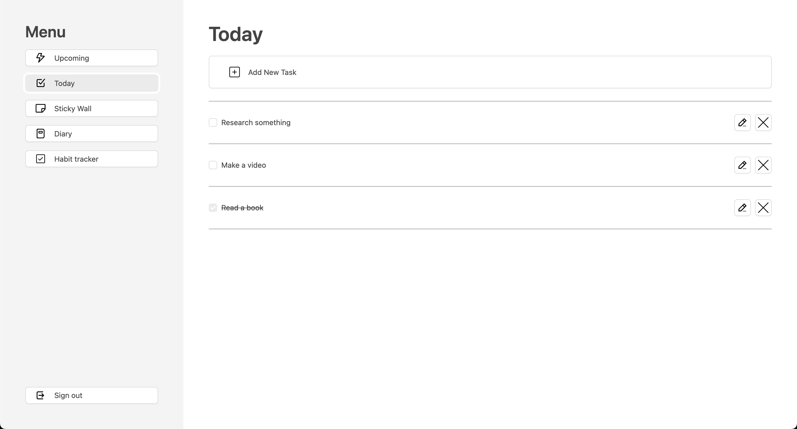
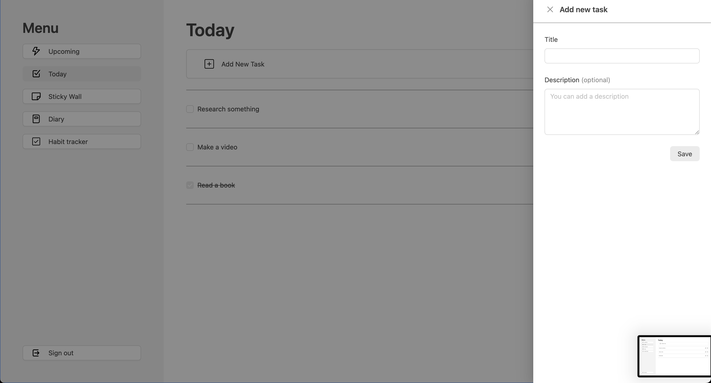
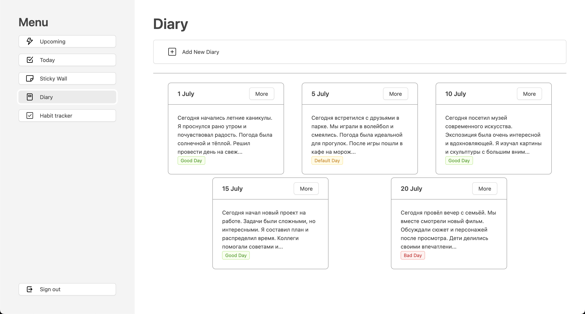
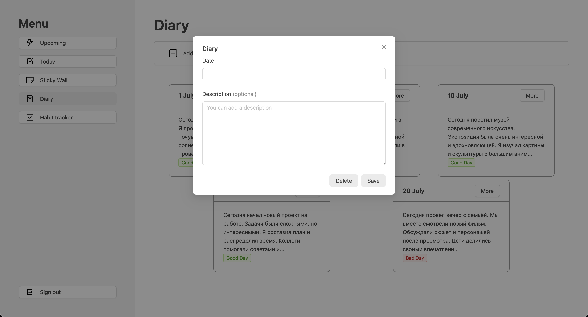
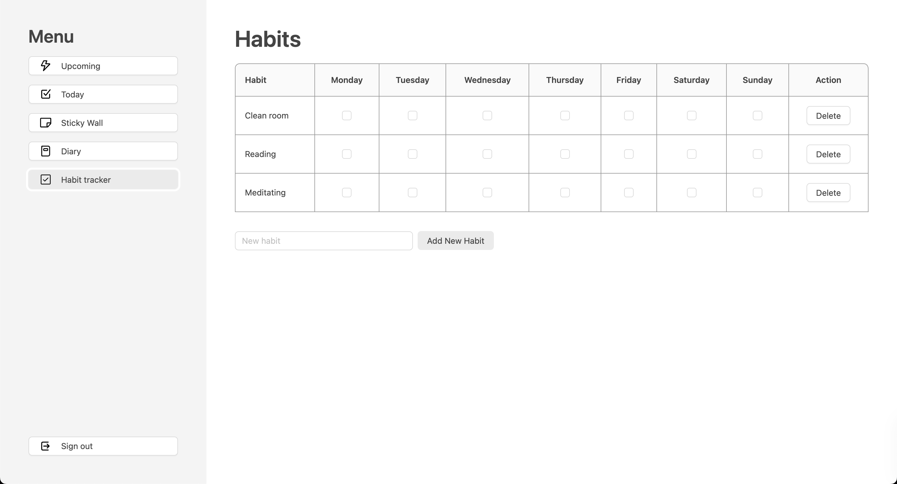

# To DO web application

**Описание:**  
Современное приложение с возможностями добавления задач на день, записей в дневник и трекера привычек.
---
## Скриншоты приложения

<div align="center">

### Десктопная версия
<div style="display: grid; grid-template-columns: repeat(2, 1fr); gap: 10px; margin: 20px 0;">
  
  
  
  
  
</div>

</div>

---

## Возможности
1. Вести планы на день
2. Добавление планов
3. Трекер привычек по дням недели
4. Добавление привычек
5. Вести дневник
6. Добавление записи в дневник

## Возможные добавления
1. Upcoming events
2. Соединение с базой данных
3. Возможность заходить на свой аккаунт
4. Темная тема

## Установка и запуск

1. Клонируйте репозиторий:
   ```bash
   git clone https://github.com/TsoyIgorDev/todo-react.git
   ```

2. Перейдите в папку проекта:
   ```bash
   cd todo-react
   ```

3. Установите зависимости:
   ```bash
   npm install
   ```

4. Запустите проект в режиме разработки:
   ```bash
   npm run dev
   ```

5. Для сборки продакшн версии:
   ```bash
   npm run build
   ```

Приложение будет доступно по адресу: `http://localhost:5173`

---

## Технологии

- **Vite** - Современный сборщик проектов
- **React** - Библиотека для построения пользовательских интерфейсов
- **Ant design** - Набор для разработки пользовательского интерфейса

---

## Структура проекта

```
nike-tailwind/
├── public/
│   ├── screenshots/    # Скриншоты для документации
│   └── ...             # Статические файлы
├── src/
│   ├── components/     # React компоненты
│   ├── assets/         # Изображения
│   ├── constants/      # Константы
│   ├── sections/       # Секции лендинга
│   └── ...             # Исходный код
├── index.html          # Главный HTML файл
├── vite.config.js      # Конфигурация Vite
└── package.json        # Зависимости проекта
```

---
